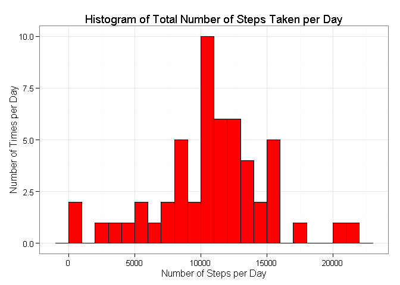
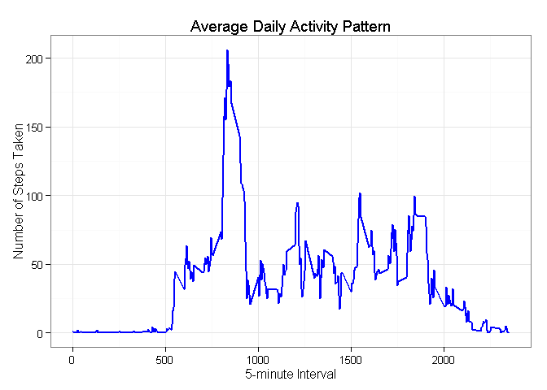
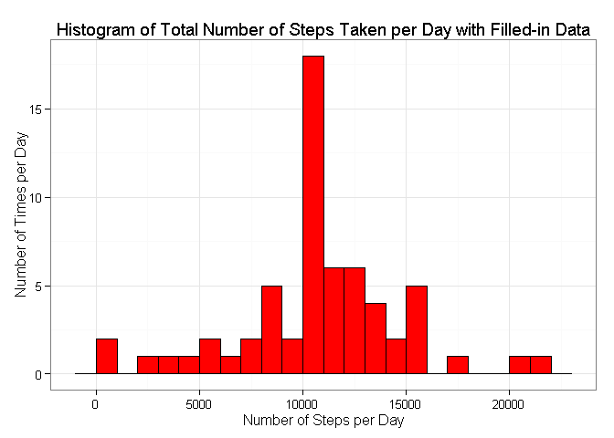
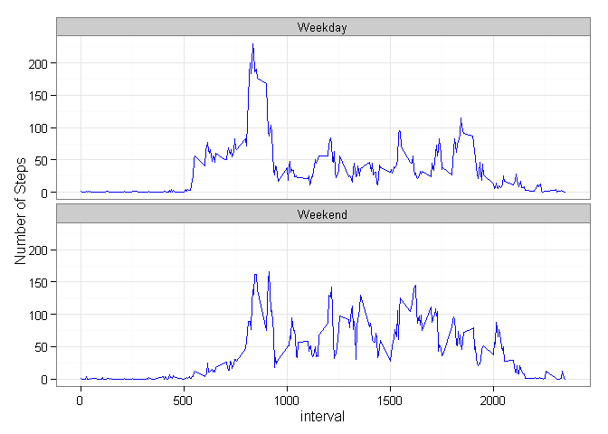

# Reproducible Research: Peer Assessment 1
#### Author: Andria Hall

#### Introduction:

This report is a Reproducible Research in a **single R Markdown** document that was processed by **knitr** and transformed into a **HTML** file. It was created from a dataset that consists of **17568** observations and **3** variables. This dataset was generated from a personal activity monitoring device that collects data at 5-minute intervals throughout the day by an anonymous individual during the month of **October** and **November 2012**.

## Prepare the working evironment

Since report requires writing code chunks in the R markdown document, I have set **echo = TRUE** and set **results = hold** as global options so that the reader can read the code.


```r
library(knitr)
opts_chunk$set(echo = TRUE, results = 'hold')
```

# Load required packages


```r
# load packages
suppressMessages(require("data.table"))
suppressMessages(require("dplyr"))
suppressMessages(require("tidyr"))
suppressMessages(require("ggplot2"))
```

## Loading and preprocessing the data

Here the activity dataset is loaded and processed for analysis


```r
# load the activity data
setwd("/Users/Andria/data/RepData_PeerAssessment1")
f <- file.path(getwd(), "activity.zip")
activity <- tbl_df(read.csv(unz(f, "activity.csv"),header= TRUE, sep= ","))

# explore activity data
head(select(activity, steps:interval))
```

```
## Source: local data frame [6 x 3]
## 
##   steps       date interval
## 1    NA 2012-10-01        0
## 2    NA 2012-10-01        5
## 3    NA 2012-10-01       10
## 4    NA 2012-10-01       15
## 5    NA 2012-10-01       20
## 6    NA 2012-10-01       25
```

## What is mean total number of steps taken per day?

Here the missing values are ignored and the total number of steps computed

```r
steps_taken <- aggregate(steps ~ date, activity, sum, na.rm = TRUE)
head(steps_taken)
```

```
##         date steps
## 1 2012-10-02   126
## 2 2012-10-03 11352
## 3 2012-10-04 12116
## 4 2012-10-05 13294
## 5 2012-10-06 15420
## 6 2012-10-07 11015
```

1. Now we can plot an histogram from **steps_taken** showing the total number of steps taken per day, using the appropriate bin interval.

```r
g <- ggplot(steps_taken, aes(x=steps)) + 
        geom_histogram(fill=heat.colors(1), col="black", binwidth=1000) +
        labs(x = "Number of Steps per Day") + 
        labs(y = "Number of Times per Day") +
        labs(title = "Histogram of Total Number of Steps Taken per Day") +
        theme_bw()
print(g)
```

 

1. Now we calculate the **mean** and **median** total number of steps taken per day


```r
steps_taken %>% summarise(steps_mean= mean(steps), steps_median = median(steps))
```

```
##   steps_mean steps_median
## 1   10766.19        10765
```
1. The **mean** number of steps is: **10766.19**
2. The **median** number of steps is: **10765**

## What is the average daily activity pattern?
1. We will now make a **time series plot** of the **average** number of steps taken across all days*(y-axis)*, of the 5-minute interval *(x-axis)*.


```r
interval_steps <- activity %>% group_by(interval) %>% summarise(avg_steps= mean(steps, na.rm=TRUE))

# time series plot of the 5-minute interval
g <- ggplot(interval_steps, aes(x=interval, y=avg_steps)) +
        geom_line(color="blue", size=1) +
        labs(title= "Average Daily Activity Pattern", x = "5-minute Interval", y="Number of Steps Taken") +
        theme_bw()
print(g)
```

 

1. We will now calculate which 5-minute interval, on average across all the days in **interval_steps**, contains the maximum number of steps.


```r
interval_steps[which.max(interval_steps$avg_steps),]
```

```
## Source: local data frame [1 x 2]
## 
##   interval avg_steps
## 1      835  206.1698
```

We can see from the report that the **835^th^** 5-minute interval, has the average maximum of **206** steps.

## Imputing missing values

We will now calculate and report the total number of rows with **NAs**.from the 
**activity** dataset created earlier.


```r
sum(is.na(activity))
```

```
## [1] 2304
```
1. The total number of rows with **NAs** is: **2304**

Now we will create a new dataset called **fill_activity**, by filling in all of the missing **NA** values in the **activity** dataset of corresponding **interval** and the **mean** for 5-minute interval in the **interval_steps** dataset.


```r
fill_activity <- activity # make a copy of original dataset
sapply(unique(activity$interval), # make interval distinct
       function(x)
               fill_activity[is.na(fill_activity) & (fill_activity$interval == x), 1] <<- interval_steps$avg_steps[interval_steps$interval == x])
```

```
##   [1]   1.7169811   0.3396226   0.1320755   0.1509434   0.0754717
##   [6]   2.0943396   0.5283019   0.8679245   0.0000000   1.4716981
##  [11]   0.3018868   0.1320755   0.3207547   0.6792453   0.1509434
##  [16]   0.3396226   0.0000000   1.1132075   1.8301887   0.1698113
##  [21]   0.1698113   0.3773585   0.2641509   0.0000000   0.0000000
##  [26]   0.0000000   1.1320755   0.0000000   0.0000000   0.1320755
##  [31]   0.0000000   0.2264151   0.0000000   0.0000000   1.5471698
##  [36]   0.9433962   0.0000000   0.0000000   0.0000000   0.0000000
##  [41]   0.2075472   0.6226415   1.6226415   0.5849057   0.4905660
##  [46]   0.0754717   0.0000000   0.0000000   1.1886792   0.9433962
##  [51]   2.5660377   0.0000000   0.3396226   0.3584906   4.1132075
##  [56]   0.6603774   3.4905660   0.8301887   3.1132075   1.1132075
##  [61]   0.0000000   1.5660377   3.0000000   2.2452830   3.3207547
##  [66]   2.9622642   2.0943396   6.0566038  16.0188679  18.3396226
##  [71]  39.4528302  44.4905660  31.4905660  49.2641509  53.7735849
##  [76]  63.4528302  49.9622642  47.0754717  52.1509434  39.3396226
##  [81]  44.0188679  44.1698113  37.3584906  49.0377358  43.8113208
##  [86]  44.3773585  50.5094340  54.5094340  49.9245283  50.9811321
##  [91]  55.6792453  44.3207547  52.2641509  69.5471698  57.8490566
##  [96]  56.1509434  73.3773585  68.2075472 129.4339623 157.5283019
## [101] 171.1509434 155.3962264 177.3018868 206.1698113 195.9245283
## [106] 179.5660377 183.3962264 167.0188679 143.4528302 124.0377358
## [111] 109.1132075 108.1132075 103.7169811  95.9622642  66.2075472
## [116]  45.2264151  24.7924528  38.7547170  34.9811321  21.0566038
## [121]  40.5660377  26.9811321  42.4150943  52.6603774  38.9245283
## [126]  50.7924528  44.2830189  37.4150943  34.6981132  28.3396226
## [131]  25.0943396  31.9433962  31.3584906  29.6792453  21.3207547
## [136]  25.5471698  28.3773585  26.4716981  33.4339623  49.9811321
## [141]  42.0377358  44.6037736  46.0377358  59.1886792  63.8679245
## [146]  87.6981132  94.8490566  92.7735849  63.3962264  50.1698113
## [151]  54.4716981  32.4150943  26.5283019  37.7358491  45.0566038
## [156]  67.2830189  42.3396226  39.8867925  43.2641509  40.9811321
## [161]  46.2452830  56.4339623  42.7547170  25.1320755  39.9622642
## [166]  53.5471698  47.3207547  60.8113208  55.7547170  51.9622642
## [171]  43.5849057  48.6981132  35.4716981  37.5471698  41.8490566
## [176]  27.5094340  17.1132075  26.0754717  43.6226415  43.7735849
## [181]  30.0188679  36.0754717  35.4905660  38.8490566  45.9622642
## [186]  47.7547170  48.1320755  65.3207547  82.9056604  98.6603774
## [191] 102.1132075  83.9622642  62.1320755  64.1320755  74.5471698
## [196]  63.1698113  56.9056604  59.7735849  43.8679245  38.5660377
## [201]  44.6603774  45.4528302  46.2075472  43.6792453  46.6226415
## [206]  56.3018868  50.7169811  61.2264151  72.7169811  78.9433962
## [211]  68.9433962  59.6603774  75.0943396  56.5094340  34.7735849
## [216]  37.4528302  40.6792453  58.0188679  74.6981132  85.3207547
## [221]  59.2641509  67.7735849  77.6981132  74.2452830  85.3396226
## [226]  99.4528302  86.5849057  85.6037736  84.8679245  77.8301887
## [231]  58.0377358  53.3584906  36.3207547  20.7169811  27.3962264
## [236]  40.0188679  30.2075472  25.5471698  45.6603774  33.5283019
## [241]  19.6226415  19.0188679  19.3396226  33.3396226  26.8113208
## [246]  21.1698113  27.3018868  21.3396226  19.5471698  21.3207547
## [251]  32.3018868  20.1509434  15.9433962  17.2264151  23.4528302
## [256]  19.2452830  12.4528302   8.0188679  14.6603774  16.3018868
## [261]   8.6792453   7.7924528   8.1320755   2.6226415   1.4528302
## [266]   3.6792453   4.8113208   8.5094340   7.0754717   8.6981132
## [271]   9.7547170   2.2075472   0.3207547   0.1132075   1.6037736
## [276]   4.6037736   3.3018868   2.8490566   0.0000000   0.8301887
## [281]   0.9622642   1.5849057   2.6037736   4.6981132   3.3018868
## [286]   0.6415094   0.2264151   1.0754717
```

1. Even though the report shows no missing values are in dataset, let us reaffirm.

```r
sum(is.na(fill_activity))
```

```
## [1] 0
```
1. The total number of rows with **NAs** is: **0**

We will now plot an histogram of the total number of steps taken each day from the filled-in **fill_activity** dataset.


```r
fill_steps_taken <- aggregate(steps ~ date, fill_activity, sum, na.rm = TRUE)

# use the ggplot to make an hisgram of the total numbers of steps each day  
g <- ggplot(fill_steps_taken, aes(x=steps)) + 
        geom_histogram(fill=heat.colors(1), col="black", binwidth=1000) +
        labs(x = "Number of Steps per Day") + 
        labs(y = "Number of Times per Day") +
        labs(title = "Histogram of Total Number of Steps Taken per Day with Filled-in Data") +
        theme_bw()
print(g)
```

 

We will now calculate the and report the **mean** and **median** total number of steps taken per day computed in the dataset **fill_steps_taken**.


```r
fill_steps_taken %>% summarise(steps_mean= mean(steps), steps_median = median(steps))
```

```
##   steps_mean steps_median
## 1   10766.19     10766.19
```
1. The **mean** number of steps is: **10766.19**
2. The **median** number of steps is: **10766.19** 

3. We can see that the **mean** **10766.19** is the same for calculated steps in the dataset with missing values and dataset without missing values, while the **median** is showing a slight difference of **1.19** in favor of the filled-in dataset, that is equivalent to the **10766.19** of its calculated **mean** value.


```r
# dataset of filled-in values for the average 5-minute interval of steps taken
fill_interval_steps <- fill_activity %>% group_by(interval) %>% summarise(fill_avg_steps= mean(steps, na.rm=TRUE))

#calculated 5-minute interval on average of maximum number of steps from filled-in dataset
fill_interval_steps[which.max(fill_interval_steps$fill_avg_steps),]
```

```
## Source: local data frame [1 x 2]
## 
##   interval fill_avg_steps
## 1      835       206.1698
```

4. From the report the **835^th^** 5-minute interval, has the same average maximum of **206** steps for the filled-in dataset as for the missing dataset, therefore the impact of imputting missing data in the missing dataset remains the same for the maximim average numbers of steps. 


## Are there differences in activity patterns between weekdays and weekends?

1. We will create a new factor variable in the dataset with two levels - "weekday"
and "weekend" indicating whether a given date is a weekday or weekend day.


```r
fill_activity <- fill_activity %>%  
        mutate(days = as.factor(ifelse(weekdays(as.Date(date)) %in% c("Saturday","Sunday"), "Weekend", "Weekday"))) %>%
        group_by(days)
```

2. Then we will make a panel plot containing a time series plot of the 5-minute interval on the (x-axis) and the average number of steps taken, averaged across all weekday days or weekend days on the (y-axis)


```r
week_days <- fill_activity %>%
        group_by(interval, days) %>%
        summarise(avg_steps = mean(steps))

g <- ggplot(week_days, aes(x=interval, y=avg_steps)) +
        geom_line(color="blue") +
        facet_wrap(~ days, nrow=2, ncol=1) +
        labs(x="interval", y="Number of Steps") +
        theme_bw()
print(g)
```

 

We observe from the graph above that more activities were done across all **weekends** than on **weekdays**, but the maximum number of activities on average are between **500** and **1000** intervals that were done on **weekdays**. This could be based on the fact that activities on **weekdays** between these intervals, mostly followed a consistent activity pattern.

The rest of the intervals shows on average, a higher but constant distribution of activity done on **weekends** than on **weekdays**, once again could be based on a consistent activity pattern, that gradually decreases as the activity period comes to an end.

## Conclusion

This report concludes by asking this vital question. What would have been the results of the activity patterns in all analysis, if the original dataset did not consist of **2304** missing values?
